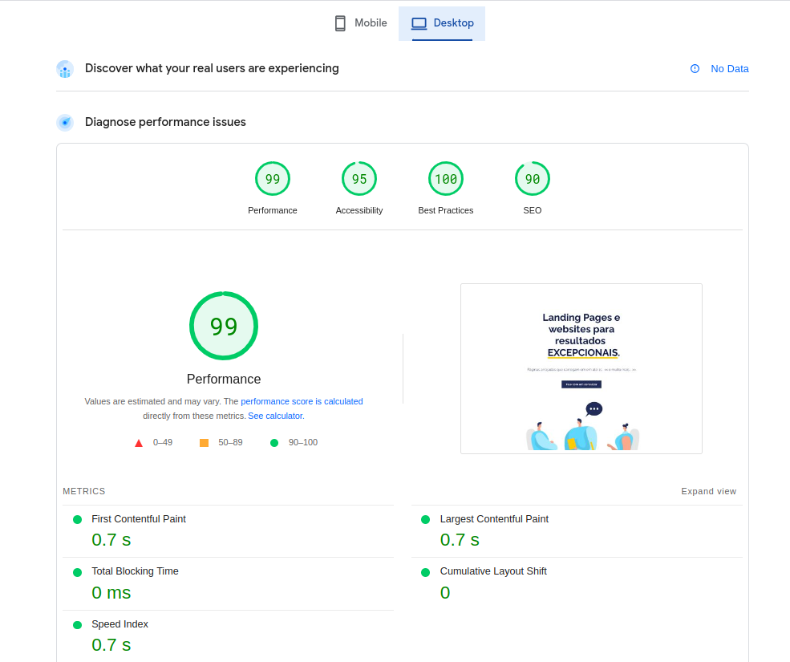

Landing Page creation for many clients around the world, using optimized services and servers, SEO techniques, and granting the best rates in the UI.
Look to some of them below:

##### [👉👉 Landing Page Services Brasil](https://lplp.bss.design/)<base target="_blank">
Landing page for a landing page services company in Brazil, which loads in 1 second with > 90% rates in Lightning.

##### [👉👉 Spero Engineering Landing Page](https://speroeng.com)<base target="_blank">
Website of our company Spero Engineering in which you can schedule a meeting with me.

### Some results ###

A simple design...

The site rates...

### Used Technologies ###
HTML, CSS, Javascript, Bootstrap, Node.js, Astro.js, Google Lightning, SEO, Copywriting, Facebook for Business, Google Analytics, Pixel instalation, WhatsApp Marketing, Telegram Marketing, Google Marketing.
