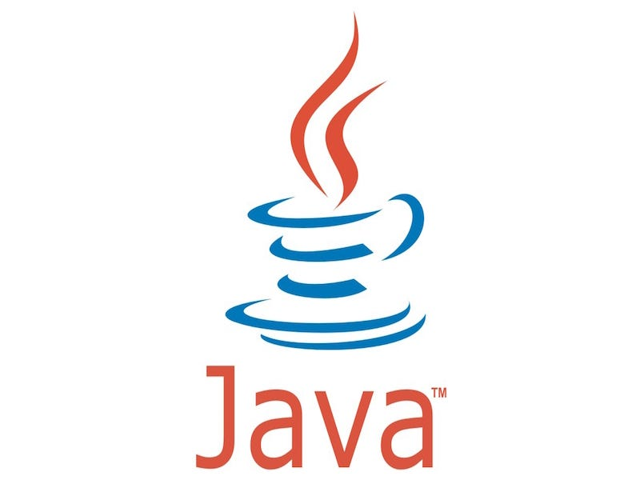
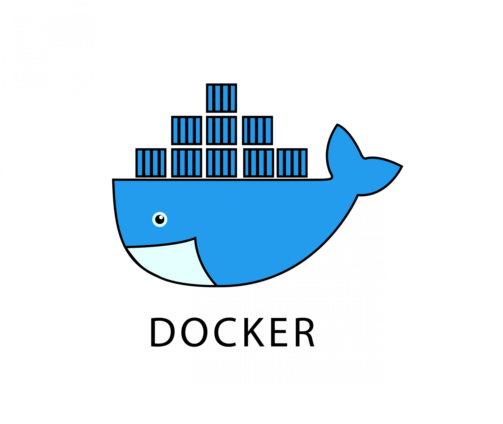
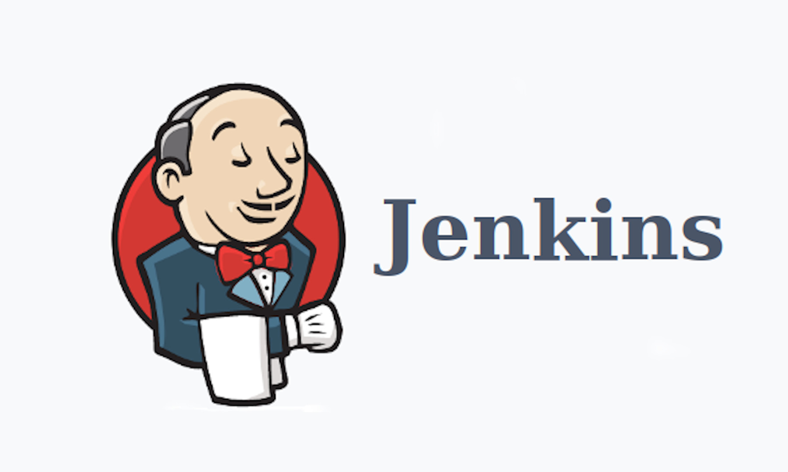
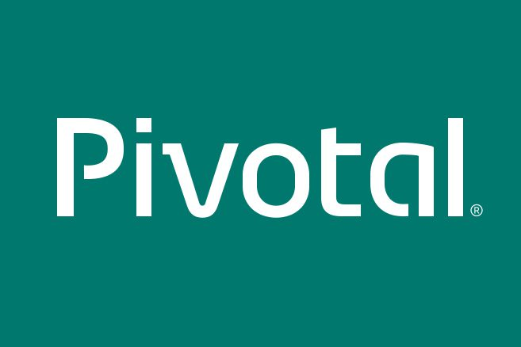

##### [👉👉 Mastercard SmartData](https://smartdata.mastercard.com/)<base target="_blank">

**Test Automation:** As a test automation engineer, for 2 years, I was responsible for more than 26 builds inside Mastercard SmartData Second Generation product.
I refactored all the automation code of SDNG, created a structure following the best-practices and managed all those builds simultaneously in a global deployment.
We created integrations with Browserstack (and tested their limits, seeing where Selenium Grid is more performatic and better), integration with Applitools and implmentation of automation accessibility testing; integration with IBM Rally for easy report for team managers and much more.

**Security Engineer:** As a security engineer, for 1 year, I was responsible for the creation of Mastercard DAST automation framework, and for Batch-Secure Deployment framework. The first project enjoy all the data generated through Functional Test Automation scripts as payload for Dynamic Application Security Tests,
through a fork of OWASP-ZAP API.

**Back-end development:** I helped on the creation of an API which server users for test in all company inside a mask in order to protect all the systems against attacks and spying.

**Front-end development:** Use HTML, CSS, JavaScript and Angular to create dashboard for Core Products.

**CI/CD & DevOps:** VMWare, Linux Servers, Jenkins. Mastercard does not use too much tools, but use extensively and deeply all the tools they pay. For example, in Jenkins we created hundreads of functions as shared libraries, and frameworks for client side integration.

##### [👉👉 Mastercard CIS](https://www.mastercardservices.com/en/solutions/implementation-deployment/)<base target="_blank">

**Manager:**

- Define and conduct implementation projects with Mastercard LATAM customers (issuers and acquirers)
- Managed more than 50 implementation projects
- Actuate in Critical and Escalated projects

**Implementation Engineer:**
- Worked to implement the Core of Transactions Payment servers around LATAM
- Implemented new MIPs (servers in the LATAM issuers and acquirers)
- Realize all the kinds of tests on the Mastercar LATAM Customers to certify their transactions are working properly
- De-install MIPs on LATAM issuers and acquirers
- Assist Mastercard Customers directly

### Used Technologies ###

<a href="https://java.com" target="_blank" rel="noreferrer">
<a href="https://spring.io/" target="_blank" rel="noreferrer">
<a href="https://www.python.org/community/logos/" target="_blank" rel="noreferrer">
<a href="https://www.docker.com/" target="_blank" rel="noreferrer">
<a href="https://www.jenkins.io/" target="_blank" rel="noreferrer">
<a href="https://www.vmware.com/company/pivotal-announcement.html" target="_blank" rel="noreferrer">
<a href="https://bitbucket.org/" target="_blank" rel="noreferrer">
<a href="https://jbehave.org/" target="_blank" rel="noreferrer">
<a href="https://www.zaproxy.org/" target="_blank" rel="noreferrer">
<a href="https://www.office.com/" target="_blank" rel="noreferrer">
<a href="https://angular.io/" target="_blank" rel="noreferrer">
<a href="https://www.broadcom.com/products/software/value-stream-management/rally" target="_blank" rel="noreferrer">
